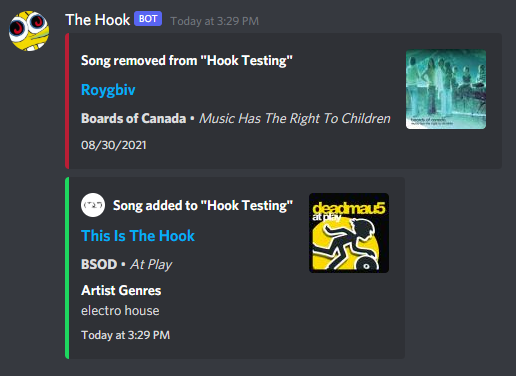

# The Hook

Track changes to Spotify playlists and post them to a Discord channel.

Spotify doesn't support webhooks, and it has no native means by which playlist updates can be monitored. This bot watches playlists for added and removed songs and will post formatted messages to a specific Discord channel when it notices them.

## Limitations

- Only one playlist can be watched per program instance. You can run the program multiple times with different `HOOK_SNAPSHOT_ID_FILE` and `HOOK_PLAYLIST_NAME` variables set to work around this.

- Spotify updates take time to propagate. If you create or rename a playlist and immediately run this program, the API might not return the playlist. Waiting a couple of minutes at most resolves this.

## Setup Instructions

To run this script you'll need a Spotify account, a Spotify Developer App, and a Discord developer account.

The script requires bot and API tokens to be in environment variables before the script is run. See the [env](./env) file for the list of configuration variables, and make sure all marked `(Required)` are set and sourced.

See the [spotipy documentation](https://spotipy.readthedocs.io/en/2.19.0/#getting-started) for `SPOTIPY_CLIENT_ID`, `SPOTIPY_CLIENT_SECRET`, and `SPOTIPY_REDIRECT_URI` variable setup instructions.

Install the required Python modules in the [requirements.txt](./requirements.txt) file.

Invite your bot to your server. See [this helpful guide](https://discordjs.guide/preparations/adding-your-bot-to-servers.html#creating-and-using-your-invite-link) from the Discord.js documentation for instructions. Currently only the `bot` Scope needs to be checked. The default Discord bot permissions (`intents`) are used, so no specific Bot Permissions should need to be checked.

Finally, run the program! You should see the bot appear online in your server. Make some changes to your monitored playlist and the bot will post about them in your defined `HOOK_UPDATE_CHANNEL`.

